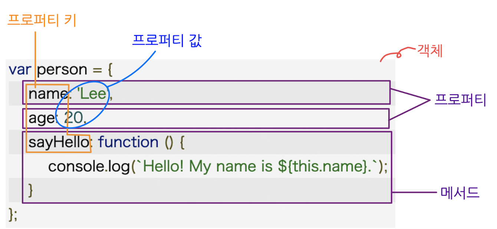

## 🗂 ch10. 객체 리터럴

### 10.1 객체란?

• 원시 값을 제외한 나머지 값(함수, 배열, 정규 표현식 등)이다.  
• 변경 가능한 값이다.

• 0개 이상의 프로퍼티로 구성된 집합이다.  
• 프로퍼티는 객체의 "상태"를 나타내는 값(data)이다.  
• 프로퍼티는 '키(key)'와 '값(value)'로 구성된다.  
• 메서드는 프로퍼티(상태 데이터)를 참조하고 조작할 수 있는 동작으로, 객체에 묶여 있는 함수를 의미한다.
<br>

**🙌 참고**  
• 세미콜론을 붙이는 경우, 안 붙이는 경우
&nbsp;&nbsp;◦코드 블록을 닫는 중괄호 뒤 → 세미콜론(;) X
&nbsp;&nbsp;◦객체 리터럴의 닫는 중괄호 뒤 → 세미콜론(;) O
<br>

### 10.3 프로퍼티

객체는 프로퍼티의 집합이며, 프로퍼티는 객체의 '상태'를 나타내는 값이다. 프로퍼티는 '키'와 '값'으로 구성된다. 프로퍼티를 나열할 때는 쉼표(,)로 구분하는데, 일반적으로 마지막 프로퍼티의 뒤에는 쉼표를 사용하지 않는다.  
프로퍼티 키와 프로퍼티 값으로 사용할 수 있는 값은 다음과 같다.  
• 프로퍼티 키: 빈 문자열을 포함하는 모든 문자열 또는 심벌 값  
• 프로퍼티 값: JS에서 사용할 수 있는 모든 값
<br>

**프로퍼티 키 네이밍 규칙**  
• 심벌 값도 프로퍼티 키로 사용할 수 있지만 일반적으로 문자열을 사용한다.  
• JS 네이밍 규칙을 따르지 않는 이름을 키 값으로 사용하고 싶다면, 꼭 따옴표('' 또는 "")를 사용해야 한다.  
• 숫자를 프로퍼티 키로 사용하면, 따옴표는 붙지 않지만 내부적으로 문자열로 암묵적 타입 변환이 이뤄진다.  
• 에러는 발생하지 않지만, 권장하지 않는 네이밍 방식
&nbsp;&nbsp;◦ 빈 문자열 사용 \_\_ 키 값으로서의 의미가 없으므로 권장하지 않는다.
&nbsp;&nbsp;◦ var, function 과 같은 예약어 사용 \_\_ 예상치 못한 에러가 발생할 여지가 있으므로 권장하지 않는다.
<br>

**✋ 주의**  
이미 존재하는 프로퍼티 키를 중복선언하면, 에러 발생이 아닌 나중에 선언한 프로퍼티로 덮어 씌여진다는 점에 주의하자.

```
var foo = {
name: 'Lee',
name: 'Kim'
};

console.log(foo);   // {name: 'Kim'}
```

<br>

### 10.5 프로퍼티 접근

프로퍼티 접근 방법으로는 마침표(.) 표기법과 대괄호(\[ ... \]) 표기법 두 가지가 있다.  
대괄호 프로퍼티 접근 연산자 내부에 지정하는 프로퍼티 키는 반드시 따옴표로 감싼 문자열이어야 한다. 따옴표로 감싸지 않는 경우, JS 엔진은 이를 식별자로 해석하여 ReferenceError 에러를 발생시킨다. 또한, 객체에 존재하지 않는 프로퍼티에 접근하면 에러가 아닌 undefined를 반환하므로 사용에 주의할 필요가 있다.

```
var person = {
name: 'Lee'
};

// 마침표 표기법에 의한 프로퍼티 접근
console.log(person.name);   // Lee

// 대괄호 표기법에 의한 프로퍼티 접근
console.log(person\['name'\]);   // Lee
```

<br>

**👉 추가로**

```
var person = {
'last-name' : 'Lee',
1 : 10
};

person.'last-name';     // → SyntaxError: Unexpected string
person.last-name;     // → 브라우저 환경: NaN , Node.js 환경 : ReferenceError: name is not defined

person\[last-name\];     // → ReferenceError: last is not defined
person\['last-name'\];     // → Lee

// 프로퍼티 키가 숫자로 이뤄진 문자열이라면 따옴표 생략 가능
person.1;     // → SyntaxError: Unexpected number
person.'1';     // → SyntzxError: Unexpected string
person\[1\];     // → 10 : person\[1\] → person\['1'\] 로 암묵적 타입 변환
person\['1'\];     // → 10
```

<br>

### 10.8 프로퍼티 삭제

`delete`연산자는 객체의 프로퍼티를 삭제한다. 만약 존재하지 않는 프로퍼티를 삭제하면, 에러 발생 없이 그냥 무시된다.

```
var person = {
name: 'Lee'
};

// 프로퍼티 동적 생성
person.age = 20;

// delete 연산자로 person 객체에 추가한 age 프로퍼티 삭제
delete person.age;

// person 객체에는 현재 'name' 프로퍼티만 존재한다.
// person 객체에 존재하지 않는 address 프로퍼티를 삭제 시도하면, 에러 발생 없이 무시된다.
delete person.address;

console.log(person);     // { name: "Lee" }
```

<br>

### 10.6 ES6에서 추가된 객체 리터럴의 확장 기능

• 프로퍼티 축약 표현  
프로퍼티 값은 변수에 할당된 값, 즉 식별자 표현식일 수도 있다. ES6에서는 프로퍼티 값으로 변수를 사용하는 경우, 변수 이름과 프로퍼티 키가 동일한 이름일 때 프로퍼티 키를 생략할 수 있고, 변수 이름으로 자동 생성된다.

```
var x = 1, y = 2;

// ES5
var obj1 = {
x: x,
y: y
};

console.log(obj1);     // { x: 1, y: 2 }


// ES6
// 프로퍼티 축약 표현
var obj2 = { x, y };

console.log(obj2);     // { x: 1, y: 2 }
```

• 계산된 프로퍼티 이름 프로퍼티 키를 동적으로 생성할 때는 표현식을 대괄호(\\\[ ... \\\])로 묶어야 한다. ES5에서는 프로퍼티 키를 동적 생성하려면 객체 리터럴 외부에서 생성했는데, ES6에서는 객체 리터럴 내부에서도 생성 가능하다.

```
// ES5
var prefix1= 'prop';
var i1 = 0;

var obj1 = {};

// 계산된 프로퍼티 이름으로 프로퍼티 키 동적 생성 - 객체 외부에서
obj1\[prefix1 + '-' + ++i1\] = i1;
obj1\[prefix1 + '-' + ++i1\] = i1;
obj1\[prefix1 + '-' + ++i1\] = i1;

console.log(obj1);     // { prop-1: 1, prop-2: 2, prop-3: 3 }


// ES6
const prefix2 = 'prop';
let i2 = 0;

// 객체 리터럴 내부에서 계산된 프로퍼티 이름으로 프로퍼티 키 동적 생성
const obj2 = {
\[\`${prefix2}-${++i2}\`\]: i2,
\[\`${prefix2}-${++i2}\`\]: i2,
\[\`${prefix2}-${++i2}\`\]: i2
};

console.log(obj2);     // { prop-1: 1, prop-2: 2, prop-3: 3 }
```

• 메서드 축약 표현 ES6에서는 메서드를 정의할 때 \\\`function\\\` 키워드를 생략하여 표현할 수 있다.

```
// ES5
var obj1 = {
name: 'Lee',
sayHi: function () {
console.log('Hi! ' + this.name);
}
};

obj1.sayHi();     // Hi! Lee


// ES6
const obj2 = {
name: 'Lee',
// 메서드 축약 표현
sayHi() {
console.log('Hi! ' + this.name);
}
};

obj2.sayHi();     // Hi! Lee
```

<br>
  
---  
<br>

## 🗂 ch11. 원시 값과 객체의 비교

### 11-1. 원시 값

원시(타입) 값은 읽기 전용으로, 변경 불가능한 값이다.  
주의해야할 것은 원시 값 자체를 변경할 수 없다는 것이지 변수 값을 변경할 수 없다는 점이다. 변수는 값을 변경할 수 있어야하는데, 원시 값인 경우에는 **재할당**으로 값을 변경할 수 있다. 변수 값을 변경할 수 없는 것은 변수(variable)가 아닌, 상수(constant)이다. 더불어 어떤 일이 있어도 '값' 그 자체는 불변하는 원시 값의 특성은 데이터의 신뢰성을 보장한다.  
<br>

**문자열과 불변성**  
문자열은 원시 값인 동시에, 유사 배열 객체이면서 이터러블이므로 배열(→ 객체)과 유사하게 각 문자에 접근할 수 있다. 따라서 원시 값의 "변경 불가능한 값" 특성과 배열 객체의 "이터러블"한 특성을 주의해야한다.

• 문자열은 원시 값으로, 변경 불가능한 값을 갖는다.

```
var str = "Hello";
console.log(str);     // Hello

str = "World!";     // str의 값을 변경하는 것이 아닌, 'World!'라는 문자열 값을 "재할당" 하는 것
console.log(str);     // World!
```

• 문자열은 유사 배열 객체로, 이터러블한 특성을 갖는다.

```
var str = "string";

// 원시 값인 문자열이 유사 배열, 객체처럼 동작한다.
console.log(str[0]);     // s
console.log(str.length);     // 6
console.log(str.toUpperCase());      // STRING

// 🔥 주의 🔥 -- 문자열은 변경 불가능한 값이므로 부분 수정이 불가하다. 원한다면 재할당으로!
str[0] = 'S';     // ← 값을 변경할 수 없지만, 에러가 발생하지는 않는다.
console.log(str);     // string
```

<br>

**원시 값 복사**  
본 책에서는 편의상 이를 "값에 의한 전달"이라고 표현했다.

```
var score = 80;
var copy = score;     // copy는 숫자 값 80으로 평가된다.
```

**"변수에 변수를 할당했을 때 무엇이 어떻게 전달되는가?"**라는 질문에 원시 값을 갖는 변수는 아래 두 가지 평가 방식으로 해석할 수 있다.

• 새로운 숫자 값 80을 생성(복사)하여 메모리 주소를 전달하는 방식.
◦ 이 방식은 할당 시점에 두 변수가 기억하는 메모리 주소가 다르다.
• score의 변수값 80의 메모리 주소를 그대로 전달하는 방식.
◦ 이 방식은 할당 시점에 두 변수가 기억하는 메모리 주소가 같다.

기억해야 할 건 위의 예제 코드 **score 변수와 copy 변수의 값은** 숫자 값 80을 갖는다는 점에서는 동일하지만, 숫자 값 80은 **각각 다른 메모리 공간에 저장된 별개의 값**이라는 것이다. 따라서 **어느 한쪽에서 재할당을 통해 값을 변경하더라도 서로 영향을 주지 않는다!**

<br>

### 11-2. 객체

객체(타입)의 값은 변경 가능한 참조 값이다. 원시 값은 값 그 자체를 갖지만, 객체 값은 생성된 객체가 저장된 메모리 공간의 주소 그 자체이다. **객체는 변경 가능한 값이기 때문에 재할당 없이 프로퍼티를 동적으로 추가, 갱신할 수 있으며, 프로퍼티 자체를 삭제할 수도 있다.**

**객체 값 복사**  
본 책에서는 편의상 이를 "참조에 의한 전달"이라고 표현했다.

```
var person = {
    name: 'Lee'
}

var copy = person;     // copy는 { name: 'Lee' }
```


위처럼 원본인 변수 person을 사본 copy에 할당하면 원본 person의 **참조 값을 복사**하여 copy에 저장한다. 이때 **원본 person과 사본 copy는 저장된 메모리 주소는 다르지만, 동일한 참조 값(=동일한 객체)를 가리킨다. 이것은 두 개의 식별자가 하나의 객체를 공유한다는 의미**이다.

```
var person1 = {
    name: 'Lee'
};

var person2 = person1;

person2.name = 'Kim';

person1.address = 'Seoul';

// person1과 person2는 동일한 객체를 가리키므로
// 어느 한 쪽에서 객체를 변경하면, 그 내용이 서로에게 영향을 준다.
console.log(person1);     // { name: 'Kim', address: 'Seoul' }
console.log(person2);     // { name: 'Kim', address: 'Seoul' }
```

이로 인해 의도와 다른 값의 변동사항이 생길 수 있으니 값을 복사할 때 주의해야 한다.

<br>

**🖍 (알아두기) 깊은 복사 & 얕은 복사**

• 깊은 복사

깊은 복사는 기존 값의 모든 참조가 끊어지고, 객체 내부에 있는 모든 값이 복사되어지는 것을 말한다. 자바스크립트에서는 할당 연산자 `=`를 사용하여 쉽게 깊은 복사를 할 수 있다.

◦ 기본형(원시형) 타입의 깊은 복사

```
var a = 10;
var b = a;

console.log(a, b);     // 10 10
console.log(a === b);     // true

b = 20;
console.log(a, b);     // 10 20
console.log(a, b);     // false
```

원시형 타입의 경우 불변 값으로, `b = 20;`을 하면서 기존에 a와 b가 갖고 있던 동일한 주소값을 b는 버리고 숫자 값 20을 재할당했다. 따라서, **원시형은 불변 값이라는 특성으로 깊은 복사를 해도 서로에게 영향을 주지 않는다.**

◦ 참조형 타입의 깊은 복사

```
var obj1 = {
    a: 10,
    b: 'abc',
};
var obj2 = obj1;

console.log(obj1 === obj2);     // true

obj2.a = 20;
console.log(obj1);     // { a: 20, b: 'abc' }
console.log(obj2);     // { a: 20, b: 'abc' }
console.log(obj1 === obj2);     // true
```

참조형 타입은 변경 가능한 값으로, `obj2.a = 20;`이 obj1과 obj2가 갖고 있는 메모리 주소 값에 변경 이유가 되지 않는다. a 프로퍼티의 값이 20으로 변경되었기 때문이다. 따라서, **참조형 타입에서의 깊은 복사는 서로에게 영향을 준다.**

• 얕은 복사  
얕은 복사는 **참조형 타입의 값의 바로 아래 단계 값(= 참조값)만 복사하는 방법**으로, 아래 코드의 `var obj2 = { ...obj1 };`처럼 `{ ...복사할 변수 }`로 작성하여 복사한다.

```
var obj1 = {
    a: 10,
    b: {
        c: 'abc',
    },
};
var obj2 = { ...obj1 };

console.log(obj1);     // { a:1, b: { c: 2 } }
console.log(obj2);     // { a:1, b: { c: 2 } }
console.log(obj1 === obj2);     // false
console.log(obj1.b === obj2.b);     // true
```

객체 obj1과 객체 obj2를 콘솔로그로 출력했을 때, 서로 동일한 객체처럼 보이지만 `obj1 === obj2`가 `false`인 이유는 객체 obj2에서 `{ ...obj1 }` '...obj1'이라는 객체 안 프로퍼티는 obj1과 obj2 모두 동일한 주소를 갖고 있지만, **객체 obj2는 `{}`라는 새 객체를 생성하여 그 안에 주소를 담았다.** 따라서 **obj2의 메모리 주소와 obj1의 메모리 주소가 다르다.**

<br>
  
**🧐 생각**  
참조형 타입의 경우 얕은 복사와 깊은 복사 방식이 이론적으로 모두 존재한다. 원본 대상과 사본 서로에게 영향을 주지 않는 얕은 복사 방식이 안전할 것 같고 생각한다. 지금 당장은 떠오르지 않지만, 어떤 상황에는 깊은 복사가 필요할 수도 있지 않을까..?

<br>
<br>

---

<br>

## 🗂 ch12. 함수

### 12-1. 함수란?

프로그래밍 언어의 **함수는 일련의 과정을 문(statement)으로 구현하고, 코드 블록으로 감싸서 하나의 실행 단위로 정의한 것이다.**


• 함수의 구성 요소
◦ 매개변수(parameter): 함수 내부로 입력을 전달받는 변수
◦ 인수(argument): 입력
◦ 반환값(return value): 출력

함수 정의만으로 함수가 실행되는 것은 아니다. **함수 호출을 하여 함수를 실행**시킬 수 있는데, 이는 인수를 매개변수를 통해 함수에 전달하여 함수의 실행을 명시적으로 지시하는 것이다.

<br>

### 12-2. 함수를 사용하는 이유

• 코드의 재사용성
• 유지보수의 편의성 &#8594; 코드의 신뢰성을 높이는 효과
• 코드의 가독성 향상

<br>

### 12-3. 함수 리터럴

리터럴은 값을 생성하기 위한 표기법을 의미한다. 자바스크립트의 함수는 객체 타입의 값으로, 함수 리터럴은 function 키워드와 함수 이름, 매개변수 목록, 함수 몸체로 구성된다.

| 구성 요소     | 설명                                                                                                                                                                                                                                                                                                                         |
| :------------ | :--------------------------------------------------------------------------------------------------------------------------------------------------------------------------------------------------------------------------------------------------------------------------------------------------------------------------- |
| 함수 이름     | - 함수 이름은 식별자다. 따라서 식별자 네이밍 규칙을 준수해야 한다.<br>- 함수 이름은 함수 몸체 내에서만 참조할 수 있는 식별자다.<br>- 함수 이름은 생략 가능하다. 이름이 있는 함수는 '기명 함수', 이름이 없는 함수는 '무명/익명 함수'라고 한다.                                                                                |
| 매개변수 목록 | - 0개 이상의 매개변수를 소괄호로 감싸고 쉼표(,)로 구분한다.<br>- 각 매개변수에는 함수를 호출할 때 지정한 인수가 순서대로 할당된다.<br>&nbsp;&nbsp;즉, 매개변수 목록은 순서에 의미가 있다.<br>- 매개변수는 함수 몸체 내에서 변수와 동일하게 취급된다. 따라서 매개변수도 변수와 마찬가지로 식별자 네이밍 규칙을 준수해야 한다. |
| 함수 몸체     | - 함수가 호출되었을 때 일괄적으로 실행될 문들을 하나의 실행 단위로 정의한 코드 블록이다.<br>- 함수 몸체는 함수 호출에 의해 실행된다.                                                                                                                                                                                         |

<br>

### 12-4. 함수 정의

함수를 정의하는 방법에는 4가지가 있다.

| 함수 정의 방식       | 예시                                              | 메모                                                                                                                                                                                   |
| :------------------- | :------------------------------------------------ | :------------------------------------------------------------------------------------------------------------------------------------------------------------------------------------- |
| 함수 선언문          | function add(x, y) { return x + y; }              | - 함수 선언문은 함수 이름을 생략할 수 없다.<br>- 함수는 '함수 이름'으로 호출하는 것이 아닌, 함수 객체를 가리키는 '식별자'로 호출하는 것이다!                                           |
| 함수 표현식          | var add = function(x, y) { return x + y; }        |                                                                                                                                                                                        |
| Function 생성자 함수 | var add = new Function('x', 'y', 'return x + y'); | 생성자 함수로 함수를 생성하면 클로저(closure)를 생성하지 않는 등 '함수 선언문'이나 '함수 표현식'으로 생성한 함수와 다르게 동작한다. 바람직한 정의 방식이 아니므로, 알아만 두자.        |
| 화살표 함수          | var add = (x, y) => x + y;                        | - 화살표 함수는 항상 익명 함수로 정의한다.<br>- 화살표 함수는 생성자 함수로 사용할 수 없으며, 기존 함수와 this 바인딩 방식이 다른 등 내부 동작 역시 일반 함수보다 간략화된 디자인이다. |

<br>

**함수 생성 시점과 함수 호이스팅**
• 함수 선언문으로 정의한 함수
◦ 함수 생성 시점: 런타임 이전에 JS 엔진에 의해 실행되어 함수 객체가 생성된다.
◦ 호이스팅: 함수 호이스팅 발생
• 함수 표현식으로 정의한 함수
◦ 함수 생성 시점: 할당문이 실행되는 시점에 평가되어 함수 객체가 된다.
&nbsp;&nbsp;&nbsp;&nbsp;&nbsp;&nbsp;&nbsp;&nbsp;&nbsp;&nbsp;&nbsp;&nbsp;&nbsp;&nbsp;&nbsp;&nbsp;&nbsp;&nbsp;&nbsp;&nbsp;&nbsp;&nbsp;&nbsp;&#8594; 함수 선언과 달리, 변수 선언은 런타임 이전에 시행되어 undefined로 초기화된다!
◦ 호이스팅: 변수 호이스팅 발생
➡️ 함수 표현식으로 정의한 함수는 반드시 함수 표현식 이후에 참조 또는 호출해야 한다.

<br>

### 12.5 함수 호출

함수를 호출하면 현재의 실행 흐름을 중단하고 호출된 함수로 실행 흐름을 옮긴다. 이때 매개변수에 인수가 순서대로 할당되고 함수 몸체의 문들이 실행된다.

#### 12.5.1 매개변수와 인수

• 매개변수 (parameter)
◦ 함수 내부로 입력(=인수)을 전달받는 변수이다.
◦ - 매개변수는 함수를 정의할 때 선언하며, 함수 몸체 내부에서 변수와 동일하게 취급된다.
• 인수 (argument)
◦ - 함수 호출 시 입력받는 것으로, 개수와 타입에 제한이 없다.
◦ - 인수는 값으로 평가될 수 있는 표현식이어야 한다.
<br>

함수는 매개변수의 개수와 인수의 개수가 일치하는지 체크하지 않는다.
• 매개변수의 개수 > 인수의 개수: 매개변수의 값은 undefined
• 매개변수 개수 < 인수의 개수: 초과된 인수는 무시되는데, 이때 암묵적으로 arguments 객체의 프로퍼티로 보내진다.

<br>

**인수 확인**

```
function add(x, y) {
	if (typeof x !== 'number' || typeof y !== 'number') {
		// 매개변수를 통해 전달된 인수의 타입이 부적절한 경우 에러를 발생시킨다.
		throw new TypeError('인수는 모두 숫자 값이어야 합니다.');
	}

	return x + y;
}

// 매개변수 y는 undefined가 되므로 의도와 다른 호출 발생
console.log(add(2));     // TypeError: 인수는 모두 숫자 값이어야 합니다.

// 인수가 숫자 값이 아닌 문자열. 계산 오류는 없으나 의도와 다른 호출 발생
console.log(add('a', 'b'));     // TypeError: 인수는 모두 숫자 값이어야 합니다.
```

자바스크립트의 경우 함수를 정의할 때 인수의 개수와 더불어 (함수 정의 의도에) 적절한 인수가 전달되었는지 확인하지 않는다. 하지만 이렇게 의도와 다른 상황이 발생하는 경우가 있어 확인할 필요가 있다.

위 예시 코드처럼 함수 내부에 적절한 인수가 전달되었는지 확인하더라도 부적절한 호출을 사전에 방지할 수는 없으며, 에러는 런타임 시 발생하게 된다. 자바스크립트의 이런 점을 보완한 것이 '타입스크립트'이다.

<br>

#### 12.5.3 매개변수의 최대 개수

ECMAScript 사양에서 매개변수의 최대 개수를 명시적으로 제한하고 있지는 않다. 하지만 순서에 의미가 있는 매개변수는 개수가 많아질 수록 이해를 어렵게 하고, 실수 발생 가능성을 높이는 등 유지보수성이 나빠진다. 따라서, **이상적인 매개변수는 0개에서 최대 3개 이상을 넘지 않는 것으로 권장**된다.

만약 그 이상의 매개변수가 필요하다면, 하나의 매개변수를 선언하고 객체를 인수로 전달하는 것이 유리하다고 한다. 객체를 인수로 사용하는 경우 프로퍼티 키만 정확히 지정하면 매개변수의 순서는 신경쓰지 않아도 되기 때문이다. 하지만 함수 외부에서 함수 내부로 전달한 객체를 함수 내부에서 변경하면, 함수 외부의 객체가 변경되는 부수 효과가 발생되므로 이 점을 주의하여 사용해야 한다.
<br>

#### 12.5.4 반환문

함수는 **`return` 키워드**와 **표현식(반환값)으로 이뤄진 반환문**을 사용하여 실행 결과를 함수 외부로 반환할 수 있다.

```
function multiply(x, y) {
	return x * y;     // 반환문
}

// 함수 호출은 반환값으로 평가된다.
var result = multiply(3, 5);
console.log(result);     // 15
```

<br>
**반환문의 역할**
• 반환문은 함수의 실행을 중단하고 함수 몸체를 빠져나간다. 반환문 이후에 다른 문이 존재하더라도, 그 문은 실행되지 않고 무시된다.
• 반환문은 return 키워드 뒤에 오는 표현식을 평가해 반환한다. return 키워드 뒤에 반환값으로 사용할 표현식을 명시적으로 지정하지 않으면 undefined를 반환한다.
	(+) 반환문은 생략할 수 있다. 이 때 함수는 함수의 마지막 문까지 실행한 후, 암묵적으로 undefined를 반환한다.

<br>

### 12.7 다양한 함수의 형태

#### 12.7.1 즉시 실행 함수

함수 정의와 동시에 즉시 호출되는 함수를 즉시 실행함수(IIFE)라고 한다. 즉시 실행 함수는 단 한 번만 호출되며 다시 호출할 수 없다.

```
// 익명 즉시 실행 함수
( function () {
	// ...
} () );

// 기명 즉시 실행 함수
( function foo () {
	var a = 3;
	var b = 5;
	return a * b;
} () );
```

즉시 실행 함수는 익명 함수를 사용하는 것이 일반적이고, 반드시 그룹 연산자 `( ... )`로 감싸서 사용해야 한다. 그룹 연산자로 함수를 묶는 이유는 함수 리터럴을 평가하여 함수 객체를 생성하기 위함이다.

**🧐 생각**
즉시 실행 함수는 언제, 어떤 식으로 쓰였을 때 유용한 개념인가?
(🔗 참고: https://circleci.com/blog/ci-cd-for-js-iifes/)
<br>

#### 12.7.2 재귀 함수

재귀 함수는 함수가 자기 자신을 호출하는, 즉 **재귀 호출을 수행하는 함수**를 말한다.
재귀 함수는 반복문 없이도 반복되는 처리를 위해 사용하는데, 재귀 함수 내에는 재귀 호출을 멈출 수 있는 **탈출 조건**을 반드시 만들어야 한다. 그렇지 않으면 함수가 무한 호출되어 스택 오버플로(stack overflow)가 발생한다.

```
// 반복문으로 처리 예시
function countdown(n) {
	for(var i = n; i >= 0; i--) console.log(i);
}

countdown(10);

// 재귀 함수 사용으로 반복 처리 예시
function countdown2(n) {
	if( n < 0 ) return;  // 탈출 조건
	console.log(n);
	countdown2(n - 1);     // 재귀 호출
}

countdown2(10);
```

<br>

#### 12.7.4 콜백 함수

• **콜백 함수: 함수의 매개변수를 통해 다른 함수의 내부로 전달되는 함수**
• 고차 함수: 매개변수를 통해 함수의 외부에서 콜백 함수를 전달받은 함수

```
function repeat(n, f) {
	for(var i = 0; i < n; i++) {
		f(i);
	}
}

// 경우1) 익명의 함수 리터럴로 콜백 함수 정의
repeat(5, function( i ) {
	if(i % 2) console.log(i);
});   // 1 3

// 경우2) 고차 함수 외부에 콜백 함수를 따로 정의
var logOdds = function( i ) {
	if(i % 2) console.log(i);
};

repeat(5, logOdds);     // 1 3
```

위 예제에서 "경우1"은 고차 함수가 호출될 때마다 콜백 함수로서 전달된 함수 리터럴은 그때마다 평가되어 **함수 객체를 생성**한다. 반면 "경우2"는 함수 표현식이 작성되는 시점에 logOdds는 단 한 번 생성된다. 따라서 **콜백 함수를 다른 곳에서도 호출할 필요가 있거나, 고차 함수가 자주 호출된다면 경우2인 함수 외부에서 콜백 함수를 정의한 후, 함수 참조를 고차 함수에 전달하는 편이 효율적**이다.

콜백 함수는 이러한 함수형 프로그래밍 패러다임뿐만 아니라 자바스크립트에서 중요한 <span style="color: red;">**'비동기 처리(이벤트 처리, Ajax 통신, 타이머 함수 등)', 배열 고차 함수(.map, .filter, .reduce 등)에 활용되는 중요한 패턴**이다!</span>

<br>

#### 12.7.5 순수 함수와 비순수 함수

• 순수 함수: 어떤 외부 상태에 의존하지 않고, 변경하지도 않는 '부수 효과'가 없는 함수

    ```
    var count = 0;     // 현재 카운트를 나타내는 상태

    // 순수 함수 increase는 동일한 인수가 전달되면 언제나 동일한 값을 반환한다.
    function increase(n) {
    	return ++n;
    }

    // **순수 함수가 반환한 결과값을 변수에 재할당하여 상태를 변경한다.**
    // 오직 매개변수를 통해 함수 내부로 전달된 인수에게만 의존하여 값을 생성, 반환한다.
    count = increase(count);
    console.log(count);     // 1

    count = increase(count);
    console.log(count);     // 2
    ```

• 비순수 함수: 함수 외부 상태에 따라 반환값이 달라지며(=의존), 함수 외부 상태를 변경하는 함수
`
	var count = 0;     // 현재 카운트를 나타내는 상태: increase 함수에 의해 변화한다.
	
	// 비순수 함수
	function increase() {
		return ++count;     // 외부 상태에 의존하며 외부 상태를 변경한다.
	}
	
	// 비순수 함수는 외부 상태(count)를 변경하므로 상태 변화를 추적하기 어려워진다.
	increase();
	console.log(count);     // 1
	
	increase();
	console.log(count);     // 2
	`

➡️ 함수형 프로그래밍은 **순수 함수**와 보조 함수의 조합을 통해 외부 상태를 변경하는 **부수 효과를 최소화**하여 **불변성을 지향**하는 프로그래밍 패러다임이다. 또한 로직 내에 존재하는 조건문과 반복문을 제거하여 복잡성을 해결하며, 변수 사용을 억제하거나 생명주기를 최소화해 상태 변경을 피해 오류를 최소화하는 것을 목표로 한다.
자바스크립트는 멀티 패러다임 언어이므로 <u>객체지향 프로그래밍뿐 아니라 함수형 프로그래밍도 적극적으로 활용</u>한다.

<br>
